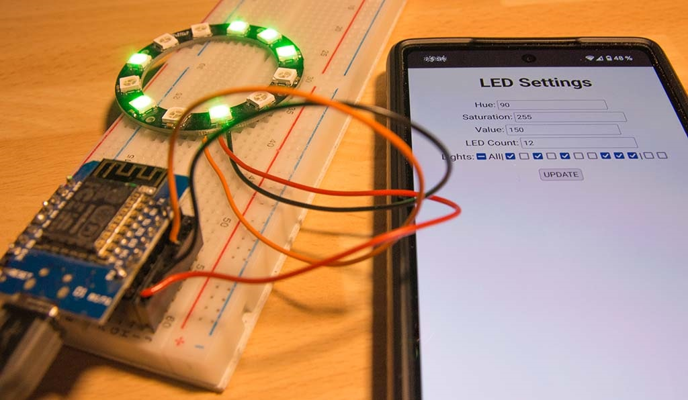

# Light Tester

This is a small script to be installed on an ESP8266 to test WS2812 LEDs.
You can set hue, saturation and value and enable or disable individual lights
via a web interface.

Quite useful to try out different light moods before cutting a led stripe into parts.

